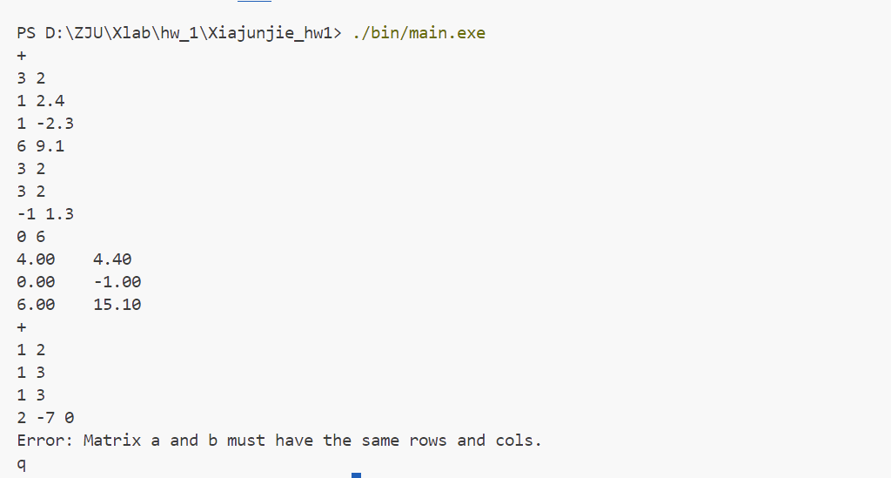
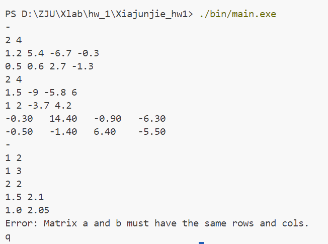
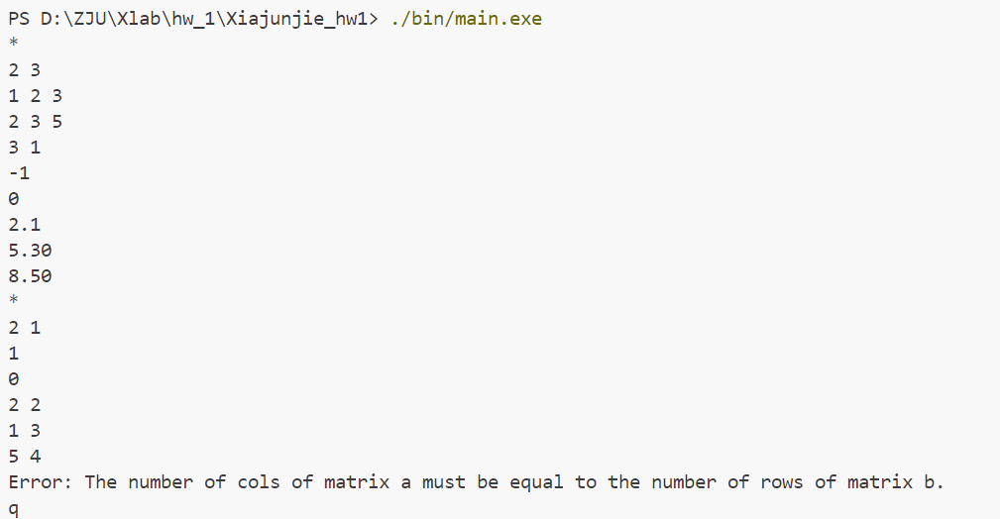
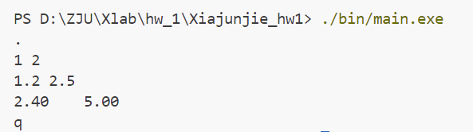
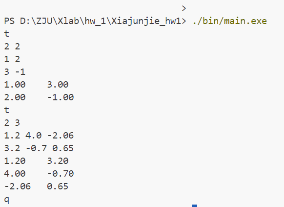
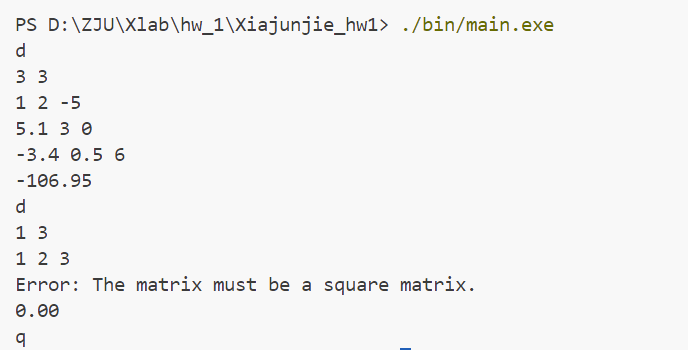
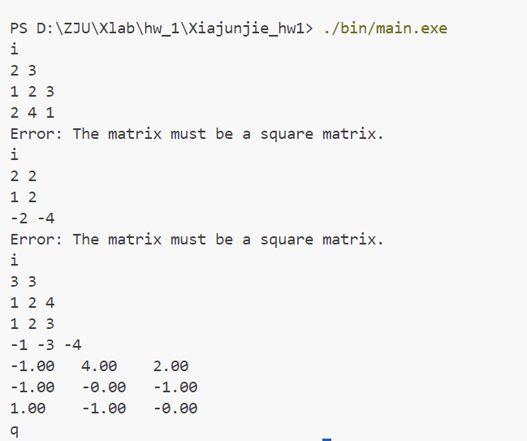
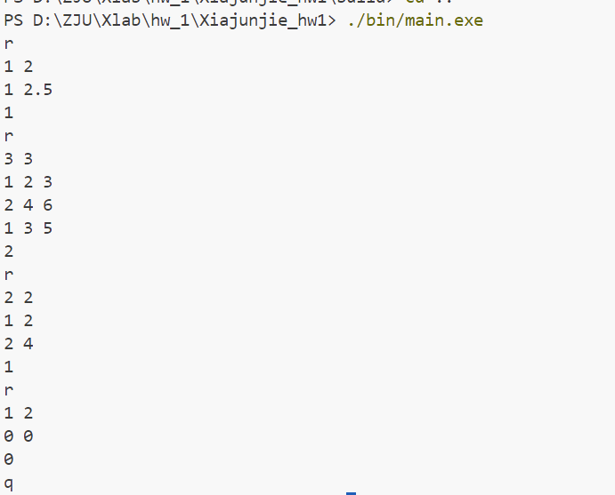
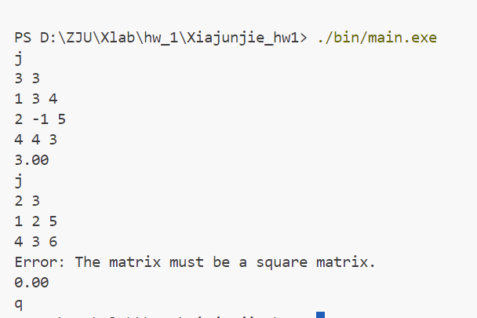

# 加法/减法运算
使用for循环对矩阵A、B的每个元素进行遍历，一一进行加减的运算并放到输出矩阵result的相应位置即可。

# 乘法运算
使用for循环对输出矩阵result的每行每列进行遍历，对第i行第J列的元素，都再使用一个for循环，累加上A的第i行与B的第j列的元素。
$$result_{ij} = \sum_{p=0}^{a.cols-1} {A_{ip} * B_{pj}}$$

# 数乘运算
用for循环遍历矩阵A中每一个元素，乘输入的元素k，再填入输出矩阵result的对应位置。（main.c里k=2.0，但是在求逆中可以看到该函数的应用）

# 转置运算
用for循环遍历A中每个元素，并填入输出矩阵result的对称位置即可
$$ result_{ji} = A_{ij} $$

# 行列式运算
用if分支处理1 * 1 、 2 * 2 和 n * n三种矩阵。前两种直接写出代数表达式。后一种使用递归。
$$|\textbf{A}|=\sum_{j=1}^n (-1)^{i+j}a_{ij}|\textbf{A}_{ij}|$$
用for循环把
$$ A_{ij} $$
取出来到中间矩阵a_ij即可，然后再把求到的值累加到输出det上。

# 求逆运算
已知逆的求解可以按照如下方式
$$ \textbf{A}^{-1}=\dfrac{1}{|\textbf{A}|}\textbf{A}^* $$
而伴随矩阵则是如下方式
$$ a^*\_{ij}=(-1)^{i+j}|\textbf{A}_{ji}| $$

因此，先用for循环写出删去了第j行和第i列的矩阵。再调用det_Matrix算出a*_ij，并填入伴随矩阵A _adj。（此处又使用了两层for循环）

最后，调用scale_Matrix函数即可。

# 求秩运算
按照thinking.md中的方法即可。先用if判断a_ii是否为0。
如果是，则需要用for遍历查看下方是否存在非零元素。
1. 如果有，那么交换该行与第i行的元素，继续执行之后所有语句
2. 如果没有，那么rank-1，直接跳入下一个大循环

接下来对遍历下方每一行，进行行运算
$$ R_j=R_j-\dfrac{a_{ji}}{a_{ii}}\times R_i $$
行运算内部再用for循环遍历每一列。

# 求迹运算
只要将主对角线元素相加即可

